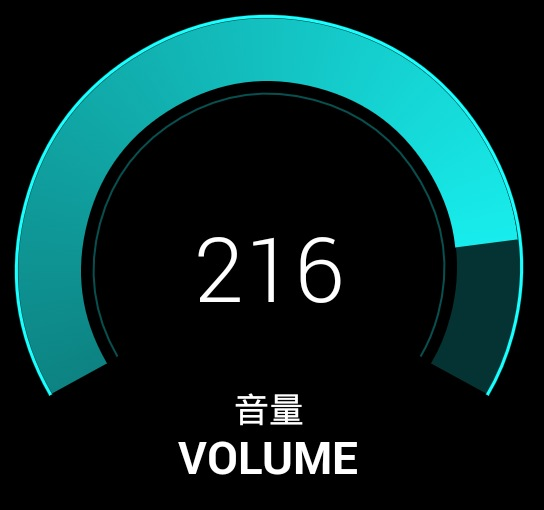
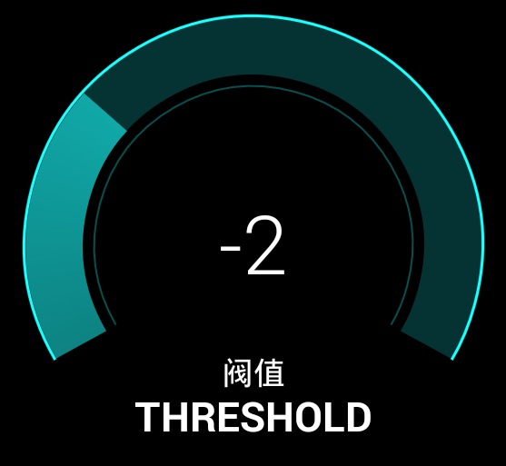
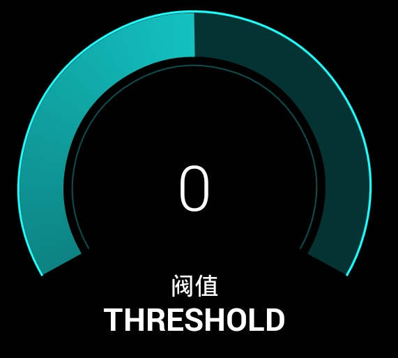
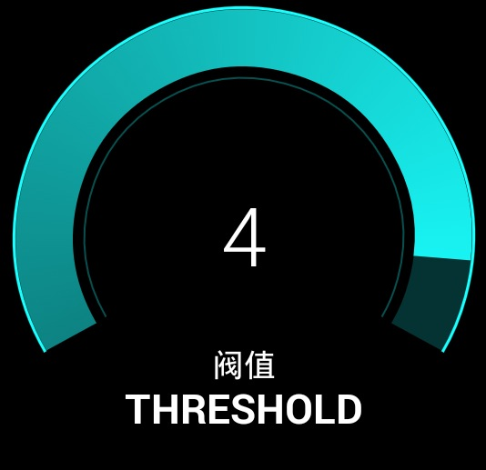

#弧形转盘

使用方法

构造方法有两种，一种默认最小值为0，一种可自定义最小值，最大最小值为负数也可正常使用  

```java
/**
 * @param context 上下文
 * @param tipTextCN 中文名
 * @param tipTextEN 英文名
 * @param maxValue 最大值
 *
 * 该初始化方法默认最小值为0
 * */
public AdjustView(Context context, String tipTextCN, String tipTextEN, int maxValue)
```

```java
/**
 * @param context 上下文
 * @param tipTextCN 中文名
 * @param tipTextEN 英文名
 * @param minValue 最小值
 * @param maxValue 最大值
 *
 * 最小值最大值为负数也可正常使用
 * */
public AdjustView(Context context, String tipTextCN, String tipTextEN, int minValue, int maxValue) 
```

示例:

```java
@Override
protected void onCreate(Bundle savedInstanceState) {
    super.onCreate(savedInstanceState);
    AdjustView adjustView = new AdjustView(context,"音量","VOLUME",255);
    setContentView(adjustView);
}
```


---
圆盘中间的数值默认是百分比，如果想显示实际数值，可调用`setPercentValue(false)`设置以实际数值显示

```java
@Override
protected void onCreate(Bundle savedInstanceState) {
    super.onCreate(savedInstanceState);
    AdjustView adjustView = new AdjustView(context,"音量","VOLUME",255);
    adjustView.setPercentValue(false);
    setContentView(adjustView);
}
```



---

圆盘还可以实现负值到正值的变化，例如想实现左右对称中间为0的效果，则可以使用第二种`5个参数的实例化方式`。(ps:同样的可以通过setPercentValue设置是否使用百分比方式显示)

```java
@Override
protected void onCreate(Bundle savedInstanceState) {
    super.onCreate(savedInstanceState);
    AdjustView adjustView = new AdjustView(this,"阀值","THRESHOLD",-5,5);
    adjustView.setPercentValue(false);
    setContentView(adjustView);
}
```




---

圆盘有值增加以及减少的接口，分别是`valueAdd()`以及`valueSubtract()`，该方法有两个重载，一种是有参数，可以增加固定值，另一种是无参数，默认增加十分之一数值，如果十分之一小于1则增加1.(ps:可以自己定义按钮或Touch事件触发转盘值的增加，源码中有示例)

```java
@Override
protected void onCreate(Bundle savedInstanceState) {
    super.onCreate(savedInstanceState);
    AdjustView adjustView = new AdjustView(this,"阀值","THRESHOLD",100);
    setContentView(adjustView);
    adjustView.valueAdd(1);
    adjustView.valueSubtract(1);
    adjustView.valueAdd();
    adjustView.valueSubtract();
}
```

其中，无参数的`valueAdd()`以及无参数的`valueSubtract()`默认一次增加或减少十分之一的，如果想自定义总共可以调节多少次，可以通过`setTotalTimes(int times)`进行设置

```java
@Override
protected void onCreate(Bundle savedInstanceState) {
    super.onCreate(savedInstanceState);
    AdjustView adjustView = new AdjustView(this,"阀值","THRESHOLD",100);
    adjustView.setTotalTimes(2);
    setContentView(adjustView);
    adjustView.valueAdd();
}
```

回调接口:调用`valueAdd()`或`valueSubtract()`后转盘的实际值会进行增减，通过`setAdjustValueListener()`重写`valueChange()`回调方法可以获得转盘变化后的值

```java
@Override
protected void onCreate(Bundle savedInstanceState) {
    super.onCreate(savedInstanceState);
    AdjustView adjustView = new AdjustView(this,"阀值","THRESHOLD",100);
    adjustView.setAdjustValueListener(new AdjustView.AdjustValueListener() {
        @Override
        public void valueChange(int oldValue, int newValue) {
            Log.w("test",oldValue+":"+newValue);
        }
    });
    setContentView(adjustView);
    adjustView.valueAdd();
}
```
