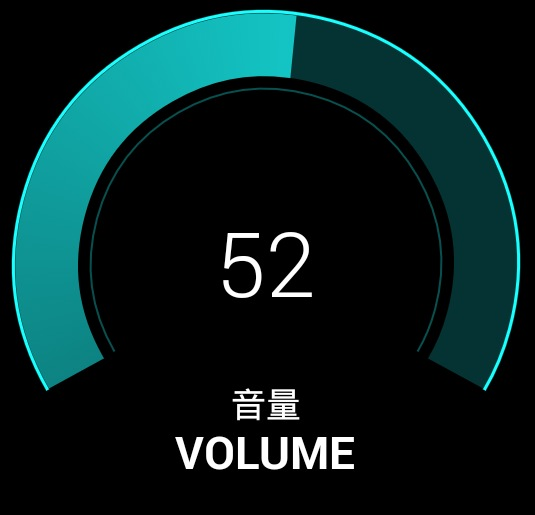

#弧形转盘

使用方法

构造方法有两种，一种默认最小值为0，一种可自定义最小值，最大最小值为负数也可正常使用  

```java
/**
 * @param context 上下文
 * @param tipTextCN 中文名
 * @param tipTextEN 英文名
 * @param maxValue 最大值
 *
 * 该初始化方法默认最小值为0
 * */
public AdjustView(Context context, String tipTextCN, String tipTextEN, int maxValue)
```

```java
/**
 * @param context 上下文
 * @param tipTextCN 中文名
 * @param tipTextEN 英文名
 * @param minValue 最小值
 * @param maxValue 最大值
 *
 * 最小值最大值为负数也可正常使用
 * */
public AdjustView(Context context, String tipTextCN, String tipTextEN, int minValue, int maxValue) {
    this(context);
    this.tipTextCN = tipTextCN;
    this.tipTextEN = tipTextEN;
    this.minValue = minValue;
    this.value = minValue;
    this.maxValue = maxValue;
}
```

示例:

```java
@Override
protected void onCreate(Bundle savedInstanceState) {
    super.onCreate(savedInstanceState);
    AdjustView adjustView = new AdjustView(context,"音量","VOLUME",255);
    setContentView(adjustView);
}
```


